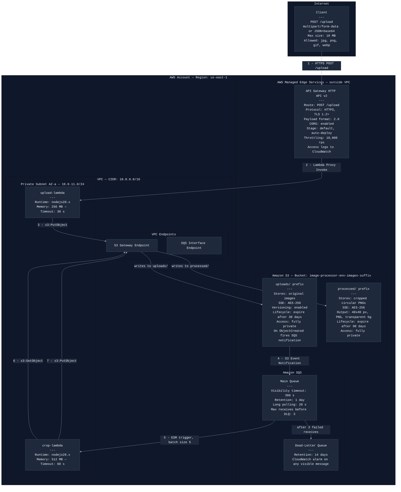

# Procesador de Imágenes — Infraestructura como Código (Terraform)

Arquitectura serverless desplegada en AWS con Terraform, que procesa imágenes subidas por un cliente HTTP, las almacena en S3, las encola en SQS y las recorta de forma circular mediante una Lambda asíncrona.

---

## Diagrama de Arquitectura



---

## Estructura del Proyecto

```
project/
├── modules/
│   ├── networking/        # VPC, subnets, IGW, NAT GW, route tables, SGs
│   ├── storage/           # S3 bucket, lifecycle, notificaciones
│   ├── messaging/         # SQS main queue + DLQ, alarmas CloudWatch
│   ├── compute/           # Lambda functions, IAM roles
│   ├── observability/     # CloudWatch log groups
│   └── api_gateway/       # API Gateway REST, integración Lambda
├── envs/
│   ├── dev/               # Entorno de desarrollo
│   ├── qa/                # Entorno de QA
│   └── prod/              # Entorno de producción
├── lambda/
│   ├── upload/            # Código fuente Node.js upload-lambda
│   └── crop/              # Código fuente Node.js crop-lambda
└── README.md
```

---

## Prerrequisitos

- Terraform >= 1.6
- AWS CLI v2 configurado con perfil IAM con permisos sobre Lambda, S3, SQS, VPC, IAM y CloudWatch
- Node.js 20.x
- Git

## Flujo de trabajo con Gitflow

Las ramas del proyecto siguen la convención de Gitflow:

- `main` — código estable y desplegado
- `develop` — integración de funcionalidades
- `funcionalidad/<nombre>` — desarrollo de cada módulo

---

## Comandos Terraform

```bash
# Inicializar
terraform init

# Validar
terraform validate

# Planear
terraform plan -out=tfplan.qa

# Aplicar
terraform apply "tfplan.qa"

# Destruir
terraform destroy
```

---

## Entornos

| Entorno | Directorio |
|---|---|
| DEV | envs/dev |
| QA | envs/qa |
| PROD | envs/prod |

## Módulos

### networking
Provisiona VPC, subnets públicas y privadas en 2 AZs, Internet Gateway, NAT Gateways, Route Tables, Security Groups y VPC Endpoints para S3 (Gateway) y SQS (Interface).

### storage
Bucket S3 privado con SSE AES-256, versionado habilitado, lifecycle rules (uploads: 30 días, processed: 90 días) y notificación S3 → SQS al crear objetos en `uploads/`.

### messaging
Cola SQS principal con redrive policy hacia DLQ (máx. 3 reintentos), política de recurso para S3, y alarma CloudWatch cuando la DLQ tenga mensajes visibles.

### compute
Roles IAM con privilegio mínimo, Lambda `upload-service` (256 MB, 30s) y Lambda `crop-service` (512 MB, 60s) con VPC config, Event Source Mapping SQS → crop con `ReportBatchItemFailures`.

### observability
Log Groups de CloudWatch para ambas Lambdas y API Gateway, con retención configurable por entorno.

### api_gateway
API Gateway REST con ruta `POST /upload`, integración Lambda proxy, stage con auto-deploy y permisos de invocación.

---

## Flujo de Datos

1. El cliente envía `POST /upload` con la imagen al API Gateway
2. API Gateway invoca `upload-lambda`
3. `upload-lambda` sube la imagen al prefix `uploads/` del bucket S3 vía VPC Endpoint
4. S3 dispara una notificación a la cola SQS principal
5. El Event Source Mapping activa `crop-lambda` con batch size 5
6. `crop-lambda` descarga la imagen desde `uploads/`
7. `crop-lambda` genera un recorte circular 40×40 px en PNG
8. `crop-lambda` sube el resultado al prefix `processed/`
9. Si el procesamiento falla 3 veces, el mensaje pasa a la DLQ y se activa la alarma CloudWatch

---

## Convenciones de Commits

Este proyecto usa [Conventional Commits]
